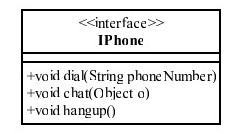
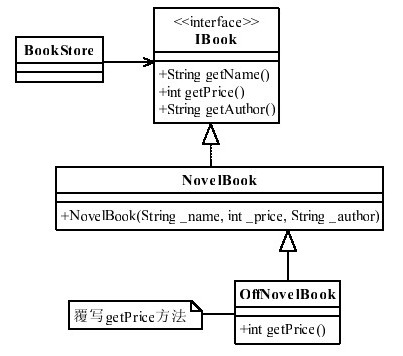

# 《重构》分享
前段时间学习了《重构》，对所学到的进行了归纳总结，整理成一篇文章，供以后的学习，并顺便分享出去，希望对阅读这篇文章的读者有所帮助。
本文先介绍在设计代码的几个基本原则，然后是遵循这些原则衍生出来方法。

## 一、代码设计的原则
一般认可度较高的代码设计基本原则有六个，本文挑选了其中的三个进行介绍。

### 1.单一职责（Single responsibility principle）
顾名思义，<u>每个类都尽量的保持着有且只有一个职责，有且只有一个原因引起类的变更</u>。这样做能保证自身功能单一、简洁，使得结构更加清晰。当某个功能需要修改时，只需要修改最小单元即可。
举个例子，如下图所示，一个Phone的类，具有拨电话、挂电话和电话交流这三个功能：

把这三个功能写在同一个接口中，这种做法不能说他是错误的，并且，这种做法是很常见的。但是按照单一职责来说，拨电话和挂电话属于拨号连接功能，电话交流属于数据传输功能，可以进行拆分，如下图所示：

将拨电话和挂电话独立成一个拨号连接的接口，将电话交流独立成数据传输的接口。这样做的好处在于，当其中某一种功能有了变动，并不会影响到另一个类的功能，减少了耦合性，降低了变更带来的风险。  

### 2.迪米特法则（Law of Demeter）
迪米特不是一个人名，而是在一个叫迪米特的项目设计中提出的一个法则。他的意思是指<u>对其他对象有最少的了解</u>，用通俗的话讲就是“自闭”，尽量少的把自身方法暴露给外界。  
举个例子，一个安装主程序需要调用一个引导程序，引导程序依次有三个步骤需要执行。面对这种需求，有这么一种做法：安装主程序依次调用三个步骤的方法，并根据每个步骤的返回值进行安装流程的判断控制，如下图所示:

让我们来评价下这种做法：这样做法虽然实现了功能，但是违反了迪米特法则，引导程序对外界暴露了太多的方法，且外部调用涉及到的东西过多了。所以不建议这种做法。  
建议的做法是，如下图所示，将三个引导程序的步骤改成private，增加一个public的方法，里面调用了安装引导的三个步骤，并将安装流程的控制权掌握在自己的类中。

这种做法的好处在于，封装了安装引导的控制逻辑，仅对外暴露了一个方法，同时也减少了外部调用的成本。如果安装步骤有了改动，也仅需改这一个方法，并不用改外部调用的逻辑。这样修改减少了代码的耦合，增加内聚性。  

### 3.开闭原则（Open-Closed Principle）
开闭原则的意思是<u>对扩展开放，对修改关闭</u>，也就是我们在设计代码，或者新增功能的时候，应该偏向于扩展新功能，而不是去修改旧功能，以提高项目的稳定性和灵活性。  

上图是已有的功能，NovelBook类具有getPrice()的方法。后来需要增加折扣的功能，按照开闭原则，尽量不修改原有的功能，也就是说不修改原接口的price，也不修改NovelBook类中的price，建议就是增加一个OffNovelBook类，继承了NovelBook类，并重写了getPrice()方法，如下图。

上图的这种做法，这样即保留了原功能，并扩展了新功能。

**小结：** 以上介绍了三种代码基本原则，另外还有三种原则：里氏替换原则、依赖倒置原则、接口隔离原则。因为篇幅有限，这三种就不在这里做过多介绍了。  

## 二、常用的重构方法
这一章主要介绍的是具体的重构方法，分别从剔除坏味道、优化代码这两个方向进行了介绍。

### 1.剔除坏味道
这一章节要介绍的一些代码中常见的不好的写法，并如何进行优化。
1. 代码 --- Duplicated  
一样的代码重复过多,可以提炼成一个方法，然后调用该方法即可，例如下图的这个例子，function1()和function2()中有一段代码是一模一样的，所以我们可以把那一段代码提炼成一个函数duplicated()，然后只要调用这个函数就可以了。  

2. 函数 --- Long  
一个函数太长，可以将某一块逻辑相对独立的代码提炼出去，用方法名归纳这一块代码的逻辑，精简了原方法里的代码逻辑。这样做还有另一个好处就是，当提炼出去的这一块代码逻辑需要修改，就不用修改原方法的其他代码，缩小了影响范围。  

3. 类 --- Large  
一个类太大，与上一点说的函数太长的情况类似，处理方法也类似。可以把某个逻辑判断的方法，提炼成单独一个类进行处理，如文件操作或字符串处理的方法等，可以提到FileUtil、StringUtil相关类中。这样即减小了自身类的大小，更关键的是对逻辑进行了分类，使代码结构变的更加清晰了。  

4. 参数 --- Long  

如上图，就是一个参数太多的情况。这里的建议就是把这些相同属性的param参数，整合成一个Param对象，这些param参数就是这Param对象中的属性，然后这函数只需要调用Param对象即可。  
这样做的好处在于，当需要增加参数param9时，只需要给这个对象增加一个属性就可以，就不用修改该方法及调用该方法的地方。

5. 注释 --- Much  
这个解释只有一句话：好的代码不需要多余的注释。
*Talk is cheap, show me code.*(注释就是辣鸡，放码过来。手动滑稽脸.jpg)

### 2.重新组织代码
这一章节要介绍的是如何优化我们的代码，包括函数和类对象。
1. 提炼函数
这里要讲的做法，与上面讲到剔除坏味道中的做法一样，就是提取重复代码，提炼逻辑独立的代码，拆分功能单一的代码。尽量做到可以一看这函数名就知道这个函数是什么功能，一看这函数里面的代码就知道是怎么实现这个功能的。  
2. 引入解释性变量
直接举个例子：

把if里面要判断的每一个条件，用一个变量进行解释，这样通过变量名，就可以清楚的知道这个判断子条件的意思，然后只需要组装判断的子条件就可以。  
当然，这个例子只是为了说明引入解释性变量这个话题。当然，这里可以再进一步优化，把if里面的四个判断子条件独立成一个函数，用isXXX()进行命名，isXXX()只需要专注于这个判断的逻辑，外部调用者也不用关心里面是如何判断的，各司其职。  
3. 搬移字段    
    + 代码中定义的一些字段，如通讯协议、错误码、多处引用的常量等，需要搬移到特有的常量类中，比如KeyName、Constant等
    + 如一些可配置的参数等，如一些地址、时长配置等，需要搬移到Config相关类中。   
这样做主要有这两种好处：  
    1. 易于修改，当需要修改时，只需要在相关类中修改一处即可，不用到处修改
    2. 易于查找，正常的ide都可以通过字段查找调用的代码，都统一调用这一字段，就可以很容易的查找到想要的代码了。
4. 提炼类
建议提炼FileUtil、StringUtil、Helper可共用的工具类，不仅可以精简代码，还能独立出库，供其他模块、项目共用。另外，也可以独立出功能相对单一的字段、函数等，遵循着上述的单一职责，可以使功能结构更清晰。

好了，以上就是关于重构要分享的全部内容了。
* * * 

## 个人总结
打一个比喻，如果说写代码是练武功的话，那么代码设计原则就是武功的内功心法，重构方法就是按照心法所练习的外功招式。我们可以遵循着这些原则心法，施展我们的代码招式，力求修炼出易读、易修改的好代码。

