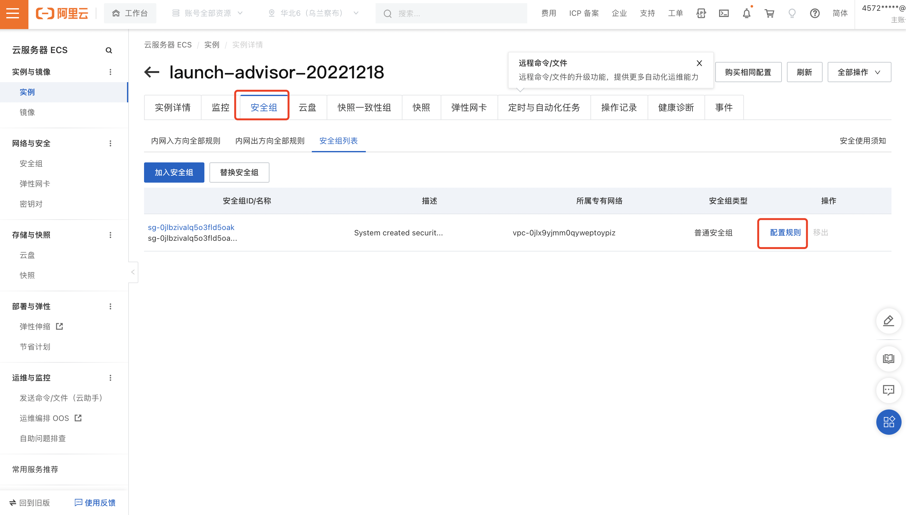

# 搭建个人网址(2)——服务器环境搭建

## 前言

本篇文章的前提是拥有一台服务器，并能通过命令行远程连接，如果没有服务器的话，参考下面这篇文章：

- [搭建个人网址(1)——连接服务器](搭建个人网址(1)——连接服务器.md)

---

本篇主要讲解如何搭建Node.js的环境，并部署一个最基本的Node项目。 参考文章https://help.aliyun.com/document_detail/172788.html


## 一、搭建Node环境
命令如下

1. 下载Node.js安装包。（会下载文件到当前文件夹，默认`/root`）

    ```
    wget https://nodejs.org/dist/v6.9.5/node-v6.9.5-linux-x64.tar.xz
    ```

2. 解压文件。

    ```
    tar xvf node-v6.9.5-linux-x64.tar.xz
    ```

3. 创建软链接，这样就可以在任意目录下直接使用node和npm命令。

    ```
    ln -s /root/node-v6.9.5-linux-x64/bin/node /usr/local/bin/node
    ln -s /root/node-v6.9.5-linux-x64/bin/npm /usr/local/bin/npm
    ```

4. 查看node、npm版本。

    ```
    node -v
    npm -v
    ```

如果能成功查看到版本，则说明Node环境已经安装完毕。

## 二、项目部署

1. 新建并编辑文件example.js。（建议新建个文件夹来操作）

    ```
    vi example.js
    ```

2. 将以下项目文件内容粘贴到文件中。

    ```
    const http =require('http');
    const hostname = '0.0.0.0';
    const port = 3000;
    const server = http.createServer((req, res) => {
        res.statusCode = 200;
        res.setHeader('Content-Type', 'text/plain');
        res.end('Hello World\n');
    });
    
    server.listen(port, hostname, () => {
        console.log(`Server running at http://${hostname}:${port}/`);
    });
    ```

3. 运行项目。

    ```
    node example.js
    ```

没报错的话，基本说明项目已经正常运行了。

## 三、添加安全组规则

解释

   `我们访问服务器的端口需要服务器配置，默认是只有80、443等常用端口，像3000端口是没有配置过的，所以需要我们自己手动添加配置。`

具体步骤：

1. 网页登录阿里云的[ECS管理控制台]界面，找到安全组的配置入口。



2. 在入方向中新增3000端口的入网规则即可（也可配置连续的端口，如3000/3010表示3000-3010之间的端口）。


## 四、访问项目

在本地机器的浏览器中输入**`http://IP:3000`**访问项目。（这里的IP就是服务器的IP）


至此，node搭建的已经可以正常访问了。

---

## 小结

至此已经搭建完一个Node项目，并访问了。但是当前的node项目是一个静态网页，并没有什么功能，下一篇用具体的应用来体现服务器的作用。

